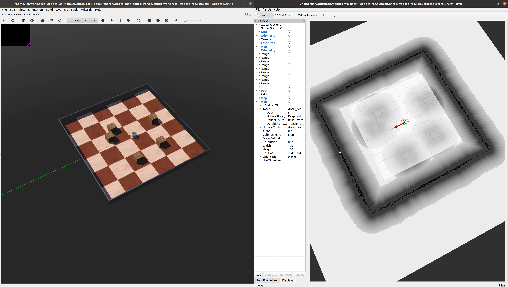

# ros2_webots_nav2

### **webots 설치** 
```bash
mkdir -p webots_ws/src
cd webots_ws/src
git clone --recursive -b foxy https://github.com/cyberbotics/webots_ros2.git # foxy / webotsR2021b released
git clone --recursive https://github.com/cyberbotics/webots_ros2.git # master / webotsR2022a released
cd ..
rosdep update
rosdep install --from-paths src --ignore-src --rosdistro foxy
colcon build --symlink-install
source install/local_setup.bash
```

### **데모 webots world & navigation**
```bash
# terminal 1
ros2 launch webots_ros2_epuck robot_launch.py
# terminal 2 navigation option
ros2 launch webots_ros2_epuck robot_tools_launch.py rviz:=true nav:=true
# termianl 3 mapping option
ros2 launch webots_ros2_epuck robot_tools_launch.py rviz:=true mapper:=true
```



### **convert map to world**
```
map2world.py 실행
N: 압축률
map_name: world 를 만들기 위한 map 이름
world_name: 생성되는 world 이름
```